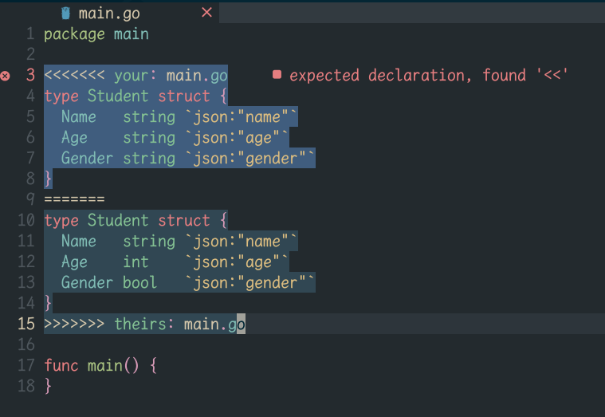

# git-conflicts.nvim

A light plugin to hightlight git conflicts regions.



# Install

lazy.nvim
```lua
{
  "youguanxinqing/git-conflicts.nvim",
  event = "VeryLazy",
  lazy = true,
  cmd = {
    "GitConflictsHighlight",
    "GitConflictsHighlightUN",
  },
  config = function()
    vim.api.nvim_create_user_command(
      "GitConflictsHighlight",
      'lua require("git-conflicts").highlight_conflicts()',
      { bang = true }
    )
    vim.api.nvim_create_user_command(
      "GitConflictsHighlightUN",
      'lua require("git-conflicts").clear_highlights()',
      { bang = true }
    )
  end,
}
```
